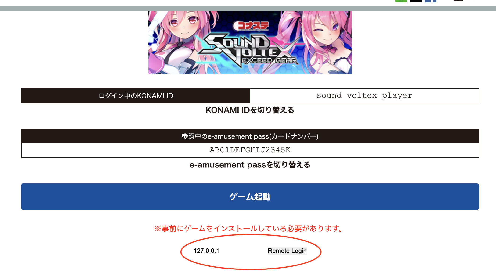

# eac-tk

Generate an EAC ticket (only for SDVX at this stage)

## Usage

### Simple Usage

1. Place **eac-tk.exe** and **start.bat** (located in the `bin` directory) somewhere on your computer.
 If your game is not installed in the default location, edit **start.bat** to change the directory.
2. Install [TamperMonkey](https://www.tampermonkey.net/) on your browser of choice. If you are using a relatively new Chrome version, you will need to [enable developer mode](https://www.tampermonkey.net/faq.php#Q209).
3. Add the `bin/eac-remote-login.js` script.
4. Run **start.bat** to start your game.
5. Navigate to [Sound Voltex EAC](https://p.eagate.573.jp/game/konasteapp/API/login/login.html?game_id=sdvx&refresh=true). Enter the IP of whichever computer is launching Sound Voltex and click Remote Login

### Advanced Usage

Use the executable however you would like - add the following snippet anywhere in a batch script to fetch a token: 
`FOR /F %%i IN ('cmd /C "set KTOR_LOG_LEVEL=ERROR && eac-tk"') DO set TOKEN=%%i`

On a separate machine, navigate to {local-ip}:44444/tk/{tk}
The ticket can be found on the game boot page with inspect element or by using the tampermonkey script provided.
