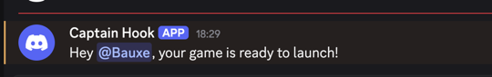

# Webhooks

Webhooks allow you send out alerts once the server is up and running. This allows for workflows in which you do not need to be present to know when the server is ready.

Currently only Discord server webhooks are available

## Discord

> Discord webhooks only operate on servers - to use a Discord webhook, you must have administrator access to a server.
> 
> You can create a server just for yourself :)

1. Navigate to Server Settings > Integrations > Webhooks
2. Create a new Webhook (or reuse an existing one) - You can configure the channel
3. Click Copy Webhook URL
4. Update your launch script to add the following arguments
    1. -w discord
    2. -u {discord_account_id}
    3. -url {webhook_url}

`FOR /F %%i IN ('cmd /C "set KTOR_LOG_LEVEL=ERROR && eac-tk -w discord -u 66747671523627008 -url https://discord.com/api/webhooks/webhook-path"') DO set TOKEN=%%i`

